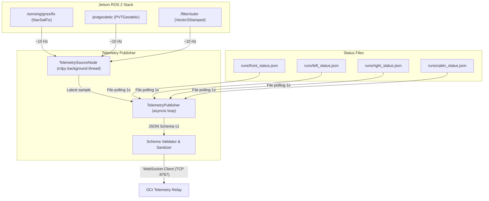

# Project Mila — Jetson Backend Architecture & Latency Optimization Guide

## 1. Executive Summary & System Overview

The **Project Mila Backend** (`project_mila_server`) is the onboard visualization and telemetry subsystem deployed on an **NVIDIA Jetson AGX Orin** inside an autonomous teleoperated vehicle. Its primary responsibilities are:
1. Capturing multi-camera video streams from hardware UVC cameras over USB.
2. Hardware-accelerating H.264 video compression and packetizing video into MPEG-TS.
3. Ingesting high-precision GNSS (Septentrio) and IMU (Xsens) navigation telemetry via ROS 2 Jazzy.
4. Streaming the multi-camera video (via SRT/UDP) and navigation telemetry (via WebSocket/TCP) over cellular/satellite uplinks to an **Oracle Cloud Infrastructure (OCI)** relay server (`MediaMTX` and custom telemetry relay).
5. Providing real-time situational awareness to a remote operator running a visualization GUI.

```
+-----------------------------------------------------------------------------------+
|                              JETSON AGX ORIN (VEHICLE)                            |
|                                                                                   |
|  +--------------------+       +--------------------+      +--------------------+  |
|  | 4x USB2 Cameras    |       | Septentrio GNSS    |      | Xsens MTi IMU      |  |
|  | (FRONT/LEFT/RIGHT/ |       | (PVTGeodetic, Fix) |      | (Fused Euler Yaw)  |  |
|  |  CABIN)            |       |                    |      |                    |  |
|  +---------+----------+       +---------+----------+      +---------+----------+  |
|            | V4L2                       | ROS2                      | ROS2        |
|            v                            +-------------+-------------+             |
|  +--------------------+                               v                           |
|  | Video Publishers   |                   +------------------------+              |
|  | (GStreamer / NVENC)|                   | Telemetry Publisher    |              |
|  | 4x Processes       |                   | (ROS2 Adapter + WS)    |              |
|  +---------+----------+                   +-----------+------------+              |
+------------|------------------------------------------|---------------------------+
             | 4x SRT (UDP:8890)                        | WebSocket (TCP:8767)
             v                                          v
+-----------------------------------------------------------------------------------+
|                                 OCI CLOUD RELAY                                   |
|                                                                                   |
|         +-----------------------+           +-----------------------+             |
|         | MediaMTX (v1.21.0)    |           | Telemetry Relay       |             |
|         | SRT Ingest / Fanout   |           | WebSocket Ingest/Cache|             |
|         +-----------+-----------+           +-----------+-----------+             |
+---------------------|-----------------------------------|-------------------------+
                      | SRT Read                          | WebSocket Read
                      v                                   v
+-----------------------------------------------------------------------------------+
|                               REMOTE OPERATOR GUI                                 |
|                                                                                   |
|                   Live Video Feeds + Real-time Telemetry Dashboard                |
+-----------------------------------------------------------------------------------+
```

---

## 2. Invariant Rules & Architectural Boundaries

### 2.1. Strict Control Plane Separation
> [!CAUTION]
> **Visualization must NEVER intersect with the vehicle control path.**
> - The vehicle control path operates over **UDP port 4210** (`G29 Wheel` -> `Sender Laptop` -> `OCI UDP Relay` -> `ESP32 Drive-by-Wire`).
> - Visualization software must **never bind, send, or listen to UDP 4210**, and must never transmit `CMD`, `MANEUVER`, or `BUTTON` messages.
> - Visualization must never be used as feedback for autonomous drive-by-wire logic.
> - A crash, reconnection storm, frame drop, or backoff in the visualization backend must **never** degrade or block vehicle control transmission.

### 2.2. Failure Isolation via Independent OS Processes
- Each camera role (`front`, `left`, `right`, `cabin`) runs in an **isolated OS process** (`video.publisher`). If one camera encounters a USB bus glitch or encoder stall, only that single process restarts with exponential backoff.
- The telemetry publisher (`telemetry.publisher`) runs in a separate process. It reads decoupled status files (`runs/<role>_status.json`) emitted by the video publishers once per second. There is **no IPC lock or blocking pipe** between video and telemetry.

### 2.3. Secret Separation & Least Privilege
- Credentials reside in `/home/mila/.config/teleop_visualization/oci_visualization.env` (file mode `0600`).
- Code enforces a strict whitelist (`JETSON_REQUIRED_VARS`) and ignores remote subscriber credentials.
- Completed SRT URIs with passphrases and tokens are redacted before logging (`uri=<redacted>`).

---

## 3. Detailed Component Architecture

### 3.1. Camera Hardware & USB Topology Subsystem
The vehicle is equipped with four identical Global Shutter Cameras (USB 2.0 native UVC devices, VID:PID `32e4:0234`).
- **USB Bus Saturation Constraint**: Because these cameras are USB 2.0 native, they negotiate at high speed (480 Mbps). MJPEG streaming across multiple cameras can saturate USB host controller isochronous bandwidth.
- **Root Controller Branch Allocation**:
  - `Root Port 002`: FRONT (`usb-2.4`) and RIGHT (`usb-2.3`).
  - `Root Port 004`: CABIN (`usb-4.2`) and LEFT (`usb-4.1.2.2`).
  *(Note: In two-camera mode, the physically verified front-facing camera on `usb-4.1.2.2` is mapped to logical role `front`).*
- **Dynamic Role Resolution (`video/camera_resolver.py`)**:
  - Device nodes `/dev/video0`, `/dev/video2`, etc. are unstable across reboots and USB re-enumeration.
  - The resolver inspects `v4l2-ctl --list-devices` and checks `Device Caps` via `v4l2-ctl --device=X --info` to locate the `Video Capture` node (distinguishing it from the `Metadata Capture` node) associated with the specific USB topology path specified in `config/cameras.yaml`.

### 3.2. Video Pipeline (`video/pipeline.py` & `video/publisher.py`)
Each camera runs an independently supervised GStreamer pipeline spawned via `subprocess.Popen`:

```mermaid
flowchart LR
    A["v4l2src\n(/dev/videoN)"] -->|"image/jpeg\n800x600@20fps"| B["jpegdec\n(CPU Decode)"]
    B -->|"video/x-raw\n(I420)"| C["nvvidconv\n(Hardware Convert)"]
    C -->|"video/x-raw(memory:NVMM)\n(I420 NVMM)"| D["nvv4l2h264enc\n(NVENC Hardware Encode)"]
    D -->|"video/x-h264"| E["h264parse\n(config-interval=-1)"]
    E -->|"video/x-h264\nbyte-stream, au"| F["mpegtsmux\n(alignment=7, pat/pmt)"]
    F -->|"MPEG-TS buffers"| G["srtsink\n(SRT over UDP)"]
    G -->|"UDP :8890"| H["OCI MediaMTX Relay"]
```



#### Pipeline Configuration Rationale:
1. **`v4l2src`**: Captures native discrete MJPEG frames from the UVC camera.
2. **`jpegdec`**: Software JPEG decoder running on CPU. (Hardware `nvjpegdec` currently fails initialization on JetPack 6 / L4T R39.2.0 with `BlockType=277`).
3. **`nvvidconv`**: Converts standard CPU memory buffers (`video/x-raw`) to Jetson unified NVMM memory (`video/x-raw(memory:NVMM)`).
4. **`nvv4l2h264enc`**: Hardware H.264 video encoder running on the Orin's NVENC engine.
   - `idrinterval=20`, `iframeinterval=20`: Generates a keyframe every ~1.0 second (at 20 FPS).
   - `insert-sps-pps=true`: Injects sequence and picture parameter sets at each IDR.
   - `poc-type=2`: Forces picture order count type 2 (display order = decode order), bypassing MediaMTX/mediacommon DTS extractor reordering checks.
5. **`h264parse`**: Sets `config-interval=-1` to ensure SPS/PPS repeat with every IDR frame. Caps are explicitly pinned to `stream-format=byte-stream,alignment=au`.
6. **`mpegtsmux`**:
   - `alignment=7`: Produces 7 TS packets per buffer ($7 \times 188 = 1316$ bytes), matching the SRT transport packet size (`pkt_size=1316`).
   - `pat-interval=9000`, `pmt-interval=9000`: 100 ms repetition on the 90 kHz MPEG-TS clock so late subscribers attach instantly.
7. **`srtsink`**: Sends the stream via Secure Reliable Transport (SRT) over UDP to OCI MediaMTX.

### 3.3. Telemetry Pipeline (`telemetry/`)
The telemetry publisher gathers sensor and health metrics and publishes them to the OCI WebSocket relay at ~10 Hz:



#### Key Implementation Details:
- **`TelemetrySourceNode` (`telemetry/ros2_adapter.py`)**: Runs inside `rclpy.spin()`. Stores latest samples for GNSS fix, geodetic speed/accuracy, and Xsens Euler yaw. Marks samples stale if not received within 2.0 seconds.
- **Heading Selection Logic**: Prioritizes GNSS course-over-ground (`cog`) when moving; falls back to Xsens IMU fused yaw when stationary/at low speed; reports `UNAVAILABLE` otherwise. Never invents values.
- **TCP Keepalive Fix**: Applies aggressive socket options (`SO_KEEPALIVE`, `TCP_KEEPIDLE=5s`, `TCP_KEEPINTVL=3s`, `TCP_KEEPCNT=3`). If the cellular/WiFi interface hops networks, connection deadlocks are broken in ~14 seconds rather than the 15+ minutes standard TCP timeout.
- **Latest-State Semantics**: No outbound message queue. Each tick transmits the newest state snapshot. If network latency delays a frame, older frames are discarded rather than building an unbounded queue.

---

## 4. Operating Modes Comparison

The backend provides three operational configurations depending on network conditions:

| Parameter | Full 4-Camera Mode | Two-Camera Mode | Minimal 1-Camera Mode |
| :--- | :--- | :--- | :--- |
| **Launch Script** | Individual camera scripts / manual | `scripts/run_two_camera_visualization.sh` | `scripts/run_minimal_visualization.sh` |
| **Active Cameras** | FRONT, LEFT, RIGHT, CABIN | Logical FRONT (`usb-4.1.2.2`), CABIN (`usb-4.2`) | CABIN (`usb-4.2`) |
| **Resolution** | 800x600 per camera | 640x480 per camera | 640x480 |
| **Framerate** | 20 FPS | 10 FPS | 10 FPS |
| **Bitrate** | 4,000,000 bps (4 Mbps) / cam | 800,000 bps (800 kbps) / cam | 800,000 bps (800 kbps) |
| **Keyframe Interval** | 20 frames (1.0 s) | 10 frames (1.0 s) | 10 frames (1.0 s) |
| **Est. Video Uplink** | ~16 – 18 Mbps aggregate | ~1.6 – 2.0 Mbps aggregate | ~0.8 – 1.2 Mbps aggregate |
| **Telemetry Rate** | ~10 Hz (GNSS, Cameras, System, IMU) | ~5 Hz (GNSS only) | ~5 Hz (GNSS only) |
| **Target Uplink** | High-bandwidth WiFi / 5G | Constrained 4G LTE / Starlink | Severe / degraded uplink (<5 Mbps) |

---

## 5. End-to-End Latency Breakdown & Bottleneck Analysis

When analyzing the end-to-end (glass-to-glass) latency from camera photon capture on the vehicle to operator GUI display, latency accumulates across multiple distinct stages:

```
[ Photon ] -> (1) Capture -> (2) Decode -> (3) Encode -> (4) Mux -> (5) SRT Send Buf -> (6) WAN RTT -> (7) MediaMTX -> (8) SRT Recv Buf -> (9) Client Decode/Render -> [ Display ]
```

### 5.1. Stage-by-Stage Latency Sources

1. **Camera Sensor Exposure & Framing (50 ms – 100 ms)**:
   - At 20 FPS, sensor readout and frame interval is **50 ms**.
   - At 10 FPS (two-camera / minimal mode), frame interval is **100 ms**.
   - The UVC hardware camera internally compresses raw frames to MJPEG before transmitting over USB.
2. **Software JPEG Decode & NVMM Upload (5 ms – 12 ms)**:
   - CPU `jpegdec` consumes CPU cycles and introduces memory transfers from host memory to NVMM.
3. **Hardware NVENC H.264 Encode (5 ms – 15 ms)**:
   - `nvv4l2h264enc` hardware encode is fast (<10 ms), but default rate-control and buffer depths may hold frames if not tuned for low latency.
4. **MPEG-TS Multiplexing (5 ms – 20 ms)**:
   - `mpegtsmux` aggregates TS packets ($7 \times 188$ bytes). Depending on bitrate and clock alignment, buffers wait until full TS packets or PCR/PAT/PMT cycles are satisfied.
5. **GStreamer Pipeline Clock & Sinks (0 ms – 50 ms)**:
   - By default in GStreamer, sink elements synchronize on pipeline clock timestamps (`sync=true`). If any upstream timestamp has slight jitter, `srtsink` or `mpegtsmux` may delay transmission to match presentation time.
6. **SRT Sender Buffer & ARQ (`latency` parameter) (120 ms+ default)**:
   - **Critical Latency Driver**: In `video/pipeline.py`, the SRT URI does **not** specify a `latency` query parameter.
   - The default SRT library latency (`SRTO_LATENCY`) is **120 ms**. SRT uses this buffer window to accommodate lost packets via ACK/NAK/ARQ retransmissions. Even on a 20 ms connection, packets are held for 120 ms unless configured otherwise.
7. **WAN Network Transit (20 ms – 80 ms)**:
   - Physical transmission over LTE/5G/Starlink to OCI datacenter. Jitter on mobile links can spike RTT.
8. **OCI Cloud Relay (`MediaMTX`) (2 ms – 10 ms)**:
   - MediaMTX receives SRT packets and immediately relays them to authenticated readers. Minimal processing overhead.
9. **Reader/Client SRT Buffer & Playback (120 ms – 200 ms)**:
   - The client reader (e.g. VLC, GStreamer, or custom GUI) typically has its own SRT reception jitter buffer (another 120 ms+) plus decoder/display buffering.
10. **Telemetry Sampling & Transport (50 ms – 200 ms)**:
    - Fixed polling loops: `asyncio.sleep(0.1)` (100 ms) or `asyncio.sleep(0.2)` (200 ms) cause quantization latency between sensor arrival and network dispatch.
    - Lack of `TCP_NODELAY`: Without `TCP_NODELAY`, Linux Nagle's algorithm can delay small telemetry packets waiting for ACK packets (up to 40 ms).

---

## 6. High-Priority Engineering Optimization Opportunities

As the software engineer tasked with lowering streaming latency and optimizing the backend, here is a prioritized roadmap of concrete technical improvements:

### Optimization 1: SRT Transport Buffer Tuning (Immediate Impact: -80 ms to -150 ms)
- **Current Situation**: `build_publish_uri` does not set `latency` or buffer parameters, defaulting to the library's conservative 120 ms+ buffer.
- **Recommended Action**:
  - In `video/pipeline.py` and `config/video.yaml`, expose SRT socket tuning options:
    - `latency=<ms>`: On cellular uplinks with an average RTT of ~30-40 ms, tune SRT latency to `60` or `80` ms (rule of thumb: $2.5 \times \text{RTT}$).
    - Set `tlpktdrop=true` (Too-Late Packet Drop): Drops packets that miss the playout deadline rather than stalling live playback.
    - Set `maxbw`: Configure maximum bandwidth to prevent congestion algorithm throttling on packet bursts.
  - Coordinate with the operator GUI team to ensure the reader URI also configures matching low latency (`latency=60-80`).

### Optimization 2: GStreamer Pipeline Latency Tuning (Impact: -20 ms to -50 ms)
- **Current Situation**: The pipeline uses default clock synchronization and queueing.
- **Recommended Action**:
  - Add `sync=false` to `srtsink`: In live streaming where `v4l2src` already sets physical capture pacing, setting `sync=false` prevents the sink from holding buffers against the pipeline clock.
  - Set `do-timestamp=true` on `v4l2src`: Accurately timestamps buffers at kernel capture time.
  - Tune `nvv4l2h264enc` low-latency properties:
    - Inspect `gst-inspect-1.0 nvv4l2h264enc` for `preset-level=1` (UltraFast) and `control-rate=constant_bitrate`.
    - Check `maxperf-enable=true` to force hardware encoder clocks to maximum performance.

### Optimization 3: Hardware JPEG Decode Recovery (`nvjpegdec`) (Impact: -5 ms to -10 ms & Lower CPU)
- **Current Situation**: `jpegdec` is software-based. `nvjpegdec` failed with `NvMMLiteOpen BlockType=277`.
- **Recommended Action**:
  - Investigate the JetPack 6 / L4T 39.2 `nvjpegdec` element. This error typically stems from mismatched GStreamer caps negotiation or missing buffer pool allocation between `v4l2src` and `nvjpegdec`.
  - Alternatively, evaluate if the cameras support direct YUYV/UYVY capture at lower resolutions (e.g. in two-camera mode) to bypass JPEG decoding completely (`v4l2src -> nvvidconv -> nvv4l2h264enc`).

### Optimization 4: Telemetry Latency & Nagle's Algorithm (Impact: -40 ms to -100 ms)
- **Current Situation**:
  - `telemetry/publisher.py` does not enable `TCP_NODELAY`.
  - Telemetry sends on a fixed timer (`asyncio.sleep(0.1)`), introducing polling quantization delay.
- **Recommended Action**:
  - In `enable_aggressive_tcp_keepalive()`, add `TCP_NODELAY`:
    ```python
    raw_socket.setsockopt(socket.IPPROTO_TCP, socket.TCP_NODELAY, 1)
    ```
  - **Event-Driven Telemetry Dispatch**: Rather than polling with `asyncio.sleep()`, trigger dispatch immediately upon receipt of a new `/sensing/gnss/fix` or `/pvtgeodetic` message (with a rate-limiting cooldown of ~10 Hz), eliminating up to 100 ms of wait time.
  - Minify JSON payload: Use `json.dumps(..., separators=(',', ':'))` to shave serialization time and bandwidth.

### Optimization 5: Architectural Evolution — WebRTC / WHIP Evaluation (Impact: Sub-100 ms Glass-to-Glass)
- **Current Situation**: Video uses MPEG-TS over SRT. MPEG-TS adds 188-byte packet overhead and PES packing delays.
- **Recommended Action (Long Term)**:
  - MediaMTX v1.21.0 natively supports **WebRTC WHIP (WebRTC HTTP Ingestion Protocol)** and **WHEP (WebRTC HTTP Egress Protocol)**.
  - WebRTC runs over RTP/SRTP with adaptive jitter buffers and congestion control (GCC), achieving sub-100 ms glass-to-glass latency in browser-based and native GUIs without MPEG-TS container overhead.
  - GStreamer can push directly to MediaMTX via `whipclientsink` or `webrtcbin`.

### Optimization 6: Jetson System Performance Locking
- **Recommended Action**:
  - Ensure the Jetson is locked into maximum performance mode:
    ```bash
    sudo nvpmodel -m 0       # MAXN performance profile
    sudo jetson_clocks       # Lock CPU, GPU, and NVENC clocks to maximum frequency
    ```
  - This eliminates dynamic clock scaling latencies when processing incoming video frames.

---

## 7. Codebase Directory Reference

| Path | Description |
| :--- | :--- |
| `config/cameras.yaml` | Stable 4-camera role to USB bus path mapping. |
| `config/cameras_two_camera.yaml` | Two-camera role mapping (corrects physical front camera USB path). |
| `config/video.yaml` | Full-mode capture and encoder parameters (800x600@20fps, 4Mbps). |
| `config/video_minimal.yaml` | Minimal/two-camera video parameters (640x480@10fps, 800kbps). |
| `video/camera_resolver.py` | Dynamically resolves USB bus paths to `/dev/videoN` image capture nodes. |
| `video/pipeline.py` | Constructs the GStreamer encode/mux/SRT command line arguments. |
| `video/publisher.py` | Supervises the camera GStreamer process, status reporting, and backoff. |
| `telemetry/ros2_adapter.py` | Subscribes to ROS 2 Septentrio GNSS and Xsens IMU topics. |
| `telemetry/publisher.py` | Manages WebSocket connection to OCI, aggressive TCP keepalive, and dispatch. |
| `telemetry/schema.py` | Constructs, sanitizes, and serializes the `vehicle_visualization` JSON payload. |
| `scripts/` | Shell launch and termination scripts for full, two-camera, and minimal modes. |
| `docs/` | Hardware baselines, camera topology, encoder validation, and protocol contracts. |

---

## 8. Verification & Regression Checklist

When modifying video or telemetry pipelines:
1. **Safety Check**: Ensure control ports (UDP 4210) and drive-by-wire logic remain untouched.
2. **Topology Check**: Never physically move camera USB cables without revalidating USB isochronous bandwidth.
3. **Decodability Check**: Verify late-joining readers can attach cleanly mid-stream (`config-interval=-1`, `pat-interval=9000`, `poc-type=2`).
4. **Secret Check**: Verify completed SRT URIs and auth tokens are never logged or exposed in `ps` output.
5. **Unit Tests**: Run tests via:
   ```bash
   python3 -m pytest tests/
   ```
